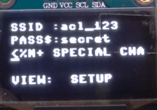

# Green House CO2 System

This project controls the CO2-level of a space by using an injection valve and
an exhaust fan.

## Hardware

The system has three sensors, one from Sensirion and two from Vaisala. The sensors
are used to obtain environmental data via Modbus and I2C to evaluate the state of the
environment.

The obtained sensor data is used to actuate a 10V (max) fan connected to the
Produal MIO I/O module to bring CO2-levels down when required. Levels are increased with
a CO2-injection valve, which is actuated with a GPIO-signal when the PPMs fall below threshold.

```
# Actuators
Produal MIO 12-PT: I/O-module for Modbus.
Exhaust Valve    : Actuated via GPIO signal.

# Sensors
Vaisala GMP252   : CO2 (parts per million, ppm), Modbus (UART).
Vaisala HMP60    : Rh (Relative Humidity, %), T (Temperature), Modbus (UART).
Sensirion SDP610 : DP (Differential Pressure, Pa), I2C.
```

## Software and System Structure

### Pico SDK & FreeRTOS

The system runs on a Raspberry Pi Pico W, and uses FreeRTOS. The current pico-sdk version
is `2.2.0`, and FreeRTOS-kernel is `V11.2.0`. Both are managed as submodules within this project.

### System definition & Tasks

The entrypoint for the system is `/src/main.cpp`, which initialises required hardware,
system structure, and calls task creation functions. Finally it starts the scheduler.

The system context is defined in `/include/system.hpp` and stores shared pointers to
appropriate hardware objects (I2C, UART, E.g.), system queue handles (GMP252, HMP60, E.g.),
event groups, mutexes (I2C bus, UART bus, E.g.), and latest reference sensor values.
This context is used in many of the system compontents for easy access to required resources,
specially if the implementation for a component hasn't been fully fleshed out to only take
the strictly required resource for its own internal context.

Tasks can be found within `/src/task` directory. Each component has its own task hpp/cpp that
defines a component specific namespace (SDP610, E.g.) and at minimum task creation and task
functions (`SDP610::task()`, `SDP610::create_task()`, E.g.). The critical tasks system-related
tasks for this project are `parser.cpp` and `controller.cpp`, which control how a component
input is parsed and the action is dispatched, and how the controller itself controls the CO2-level,
respectively.

The parser will dispatch actions to implementations in `/src/action` directory. Many of which
signal the system by using the `system.events` event group, whose flags are defined in system.hpp
(`SYSTEM::FLAG_CO2_HIGH`, E.g.).

### Network Connectivity

The system supports networking via LwIP, and can be connected to a WiFi network by using
the screen and local input buttons to enter the SSID and its password. The screen indicates
the status of network connection. This network connectivity is used to send system
data (sensor values, actuator status) to ThingSpeak at defined intervals (30s by default).



The rotary encoder moves along the currently active row of characters to choose from.
Button 1 will change the currently displayed and selectable row of characters, allowing the
user to cycle through a list of sensible characters to input into the SSID and PASS fields.
A special row of characters exist where the following key-functionality mapping exists:

```
< : delete current character
% : reset currently active field
N : change active field to the next one
+ : initiate wifi handshake
```

When the device has successfully connected to a network, it will request a DHCP lease to
obtain an IP. The `wifi_send.cpp` implementation and its definition define the API-path
and data fields which are to be sent. DNS is supported for name resolution through LwIP.

While callbacks for HTTP Headers, Body, and Result are implemented, the talkback queue
functionality via ThingSpeak is not. Mbed-TLS initialisation remains unfinished, so the
current data transmission is insecure and should only be used in development.

## Building

```
# Clone the repository
git clone "https://github.com/tbkfi/VerdantAbode"

# Enter and Initialise
cd ./VerdantAbode/ && git submodule update --init --recursive

# Build
mkdir -p ./build/ && cd ./build/ && cmake .. && cmake --build . -j$(nproc)
```

Building and flashing can optionally be done using the `build.sh` (cmake, ninja) and
`flash.sh` (openocd) bash scripts for convenience.
